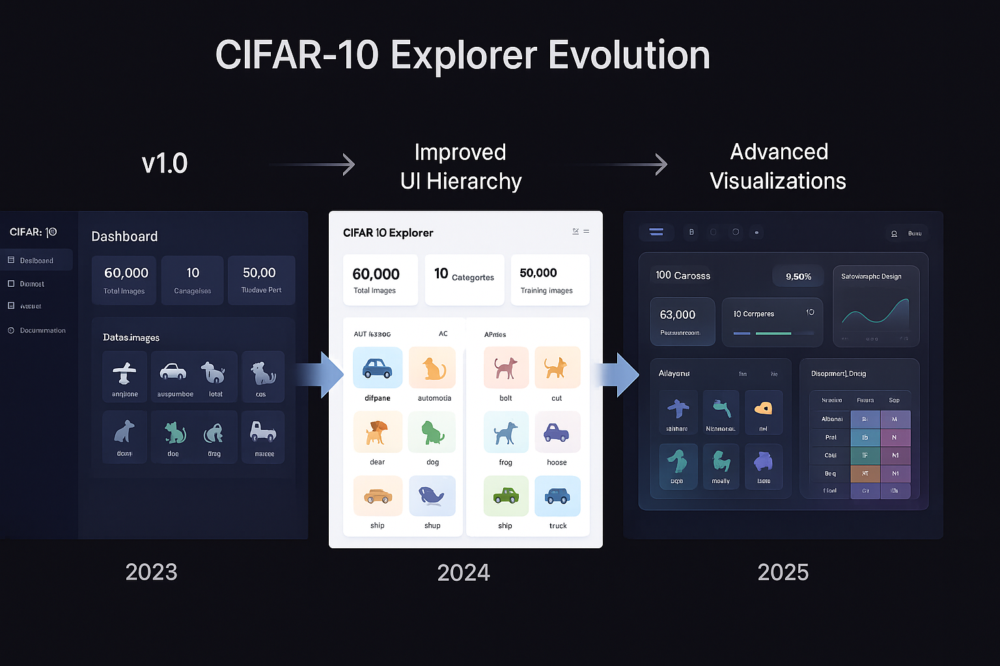

# CIFAR-10 Explorer Project

  



> A comprehensive platform for exploring, visualizing, and training models on the CIFAR-10 dataset - evolving across three distinct versions.

## Project Evolution

The CIFAR-10 Explorer project has evolved through three major versions, each representing a significant advancement in functionality, design, and user experience:

### Version 1: CIFAR-10 Explorer (2023)
- Initial release focusing on core functionality
- Basic interface for dataset exploration and model training
- Fundamental visualization capabilities
- Support for CNN, ResNet, and MobileNet architectures

### Version 2: CIFAR-10 Explorer Enhanced (2024)
- Redesigned interface with improved usability
- Enhanced visualizations and data presentation
- Expanded training options and configurations
- Improved performance and responsiveness
- Better mobile support

### Version 3: CIFAR-10 Nexus (2025)
- Complete reimagining with cutting-edge glassmorphic design
- Advanced analytics platform with interactive visualizations
- Real-time training monitoring with comprehensive metrics
- Dark/light theme support
- New EfficientNet architecture support
- AI-powered insights and recommendations

## Comparison of Versions

| Feature | Version 1 | Version 2 | Version 3 |
|---------|-----------|-----------|-----------|
| UI Design | Basic functional | Modern clean | Glassmorphic with reflections |
| Themes | Light only | Light only | Dark & Light |
| Models Supported | 3 | 3 | 4 |
| Analytics | Basic | Enhanced | Advanced interactive |
| Mobile Support | Limited | Good | Excellent |
| Data Visualization | Simple charts | Interactive charts | Real-time dashboards |
| Performance | Basic | Improved | Optimized |
| Storage | Basic local | Enhanced local | Comprehensive with sync |

## Version Selection Guide

- **Version 1**: Best for educational purposes, basic exploration, and low-resource environments
- **Version 2**: Recommended for general use, balanced between features and performance
- **Version 3**: Ideal for professional users, researchers, and those who need advanced analytics

## Installation

Each version has its own repository and installation instructions:

### Version 1
```bash
git clone https://github.com/yourusername/cifar10-explorer.git -b v1.0.0
cd cifar10-explorer
# Follow README.md instructions
```

### Version 2
```bash
git clone https://github.com/yourusername/cifar10-explorer.git -b v2.0.0
cd cifar10-explorer
# Follow README.md instructions
```

### Version 3
```bash
git clone https://github.com/yourusername/cifar10-nexus.git
cd cifar10-nexus
# Follow README.md instructions
```

## System Requirements

| Requirement | Version 1 | Version 2 | Version 3 |
|-------------|-----------|-----------|-----------|
| Browser | Modern | Modern | Modern with WebGL |
| Memory | 2GB+ | 4GB+ | 8GB+ |
| Storage | 100MB | 200MB | 500MB |
| Processor | Basic | Mid-range | High-performance |
| Dataset | Optional | Optional | Optional |

## Contributing

We welcome contributions to any version of the project! Please see the CONTRIBUTING.md file in each repository for specific guidelines.

## License

All versions of this project are licensed under the MIT License - see the LICENSE file in each repository for details.

## Project Roadmap

- **Version 3.1**: Enhanced model export options and deployment tools
- **Version 3.2**: Collaborative features and team workspaces
- **Version 4.0**: (Planning) Full-stack application with backend processing and database storage

## Acknowledgments

- CIFAR-10 dataset by Alex Krizhevsky, Vinod Nair, and Geoffrey Hinton
- All contributors across the project's evolution
- The AI and web development communities for inspiration and feedback

---

<p align="center">
  <b>CIFAR-10 Explorer: Evolving the way we interact with image classification datasets</b>
</p>
