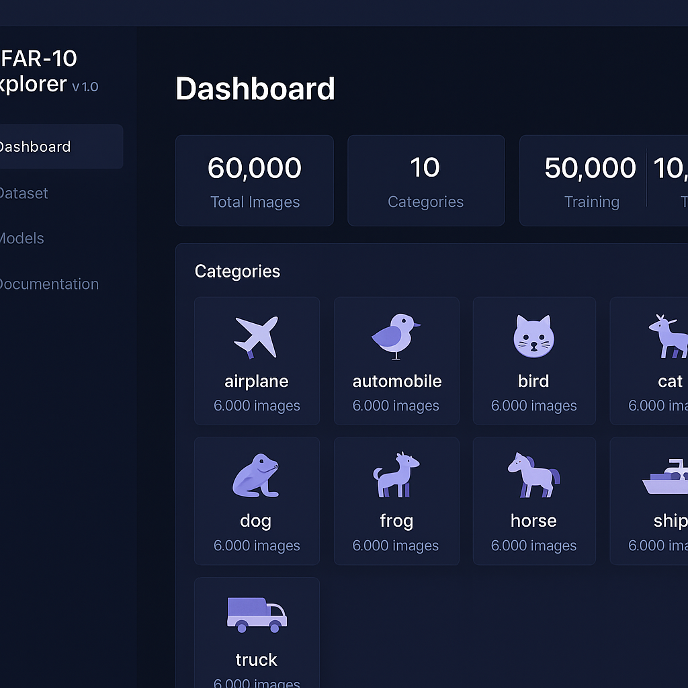

# CIFAR-10 Explorer (v1.0.0)

 


> A professional interface for exploring, visualizing, and training models on the CIFAR-10 dataset.

## Overview

CIFAR-10 Explorer provides an intuitive web interface for working with the popular CIFAR-10 image classification dataset. This tool allows researchers, students, and AI enthusiasts to browse the dataset, visualize its contents, and train machine learning models directly in the browser.

## Features

### Dataset Exploration
- Browse through all 10 categories of the CIFAR-10 dataset
- View sample images from both training and test sets
- Category statistics and distribution visualization

### Model Training
- Train different neural network architectures:
  - Convolutional Neural Network (CNN)
  - ResNet-18
  - MobileNetV2
- Configure training parameters:
  - Learning rate
  - Batch size
  - Number of epochs
  - Data augmentation options

### Training Visualization
- Real-time progress tracking
- Training metrics logging
- Loss and accuracy visualization

### Model Management
- Save and manage trained models
- View model performance statistics
- Download trained models for external use

## Installation

1. Clone the repository:
```bash
git clone https://github.com/yourusername/cifar10-explorer.git
cd cifar10-explorer
```

2. Open `index.html` in your browser or set up a local server:
```bash
# Using Python
python -m http.server 8000

# Or using Node.js
npx serve
```

3. Navigate to http://localhost:8000 in your browser

## Project Structure

```
cifar10-explorer/
├── index.html          # Main HTML document
├── css/
│   └── styles.css      # CSS styles
├── js/
│   └── scripts.js      # Application logic
└── datasets/
    └── cifar-10/       # Dataset directory (not included in repo)
        └── images/
            ├── train/  # Training set images
            └── test/   # Test set images
```

## Browser Compatibility

- Chrome (recommended)
- Firefox
- Safari
- Edge

## Future Plans

- Export models to various formats
- Advanced model architectures
- Performance benchmarking tools
- Batch processing capabilities

## License

This project is licensed under the MIT License - see the LICENSE file for details.

## Acknowledgments

- CIFAR-10 dataset by Alex Krizhevsky, Vinod Nair, and Geoffrey Hinton
- Inspired by various deep learning educational platforms and tools
