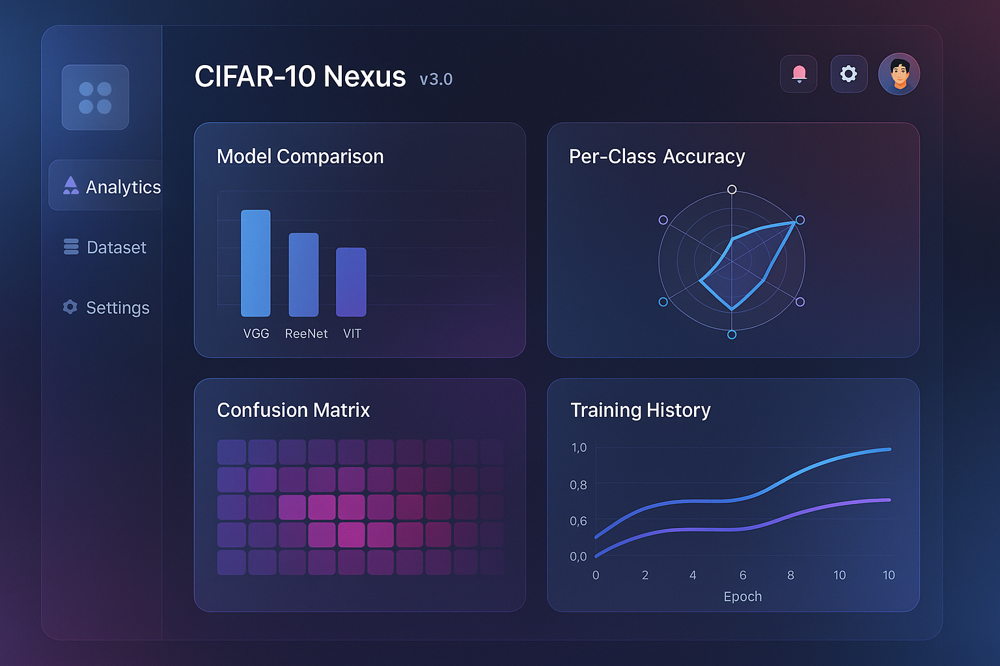

# CIFAR-10 Nexus (v3.0.0)

  



> An immersive web platform for exploring, visualizing, and training models on the CIFAR-10 image classification dataset.


## Introducing CIFAR-10 Nexus

Version 3.0 represents a complete reimagining of the CIFAR-10 Explorer platform with a cutting-edge design and powerful new capabilities. The new "Nexus" name reflects our vision of creating a central hub for image classification exploration and training.

## ✨ Key Features

### 🎛️ Immersive Dashboard
- **Animated Statistics**: Dynamic counters with fluid animations
- **Multi-gradient UI**: Stunning glassmorphic interface with reflection effects
- **Activity Timeline**: Track recent interactions and training sessions
- **Intelligent Categories**: Visually engaging category cards with usage tracking

### 🔎 Enhanced Dataset Browser
- **Multi-view Options**: Toggle between grid and list views
- **Advanced Filtering**: Search and sort across dataset categories
- **Detailed Previews**: High-resolution image viewer with metadata
- **Smart Navigation**: Remember previously viewed categories

### 🧠 Advanced Model Training
- **Expanded Architecture Options**: New EfficientNet model support
- **Live Training Visualization**: Watch accuracy and loss curves in real time
- **Interactive Controls**: Pause, resume, or cancel training sessions
- **Enhanced Augmentation**: Additional data augmentation techniques
- **Real-time Metrics**: Comprehensive statistics during training

### 📊 New Analytics Platform
- **Model Comparison**: Interactive charts comparing model performance
- **Per-class Analysis**: Identify strengths and weaknesses across categories
- **Confusion Matrix**: Visualize classification errors
- **Resource Analysis**: Track computational efficiency
- **AI Insights**: Automated performance improvement suggestions

### 🎨 State-of-the-art Interface
- **Glassmorphic Design**: Translucent components with depth effects
- **Reflection Effects**: Subtle light reflections on interactive elements
- **Dark/Light Themes**: Toggle between modes with persistent settings
- **Responsive Interface**: Seamless experience across all device sizes
- **Smooth Animations**: Polished motion design throughout the application

## Getting Started

### Prerequisites
- Modern web browser (Chrome, Firefox, Safari, or Edge)
- Basic understanding of machine learning concepts

### Installation

1. Clone the repository:
```bash
git clone https://github.com/yourusername/cifar10-nexus.git
cd cifar10-nexus
```

2. Launch a local development server:
```bash
# Using Python
python -m http.server 8000

# Using Node.js
npx serve
```

3. Navigate to http://localhost:8000 in your browser

### Quick Start Guide

1. **Dashboard**: Begin by exploring dataset statistics and category breakdowns
2. **Dataset**: Browse images by category with advanced filtering options
3. **Models**: Train models with your preferred architecture and parameters
4. **Analytics**: Compare model performance and gain insights

## Technology Stack

- **Frontend**: HTML5, CSS3, JavaScript (ES6+)
- **Data Visualization**: Chart.js for interactive analytics
- **UI Framework**: Custom-built CSS framework with glassmorphic components
- **Storage**: LocalStorage for persistent preferences and saved models

## Project Structure

```
cifar10-nexus/
├── index.html          # Main HTML document
├── css/
│   └── styles.css      # Comprehensive stylesheet with glassmorphic components
├── js/
│   └── scripts.js      # Application logic and interactive features
└── datasets/
    └── cifar-10/       # Image dataset directory (not included in repo)
        └── images/
            ├── train/  # Training set images (50,000)
            └── test/   # Test images (10,000)
```

## Machine Learning Models

CIFAR-10 Nexus supports training and evaluation of several neural network architectures:

| Architecture | Parameters | Training Time | Typical Accuracy | Best For |
|--------------|------------|---------------|------------------|----------|
| CNN          | ~1.2M      | 5-10 minutes  | 82%              | Quick experiments, learning |
| ResNet-18    | ~11M       | 15-20 minutes | 89%              | High accuracy, research |
| MobileNetV2  | ~2.3M      | 8-12 minutes  | 87%              | Balanced performance, deployment |
| EfficientNet | ~5.3M      | 12-18 minutes | 91%              | State-of-the-art results |

## Future Development Roadmap

- **Transfer Learning**: Import pre-trained models from popular frameworks
- **Custom Architectures**: Build your own neural network designs
- **Explainable AI**: Visualize neural network decision-making
- **Collaborative Features**: Share and compare models with other users
- **Export Options**: Deploy trained models to various platforms

## Contributing

Contributions are welcome! Please check the CONTRIBUTING.md file for guidelines.

## License

This project is licensed under the MIT License - see the LICENSE file for details.

## Acknowledgments

- CIFAR-10 dataset by Alex Krizhevsky, Vinod Nair, and Geoffrey Hinton
- The open-source community for tools and libraries
- Feedback from our growing community of users

---

<p align="center">
  <i>Explore. Visualize. Train. Understand.</i><br>
  <b>CIFAR-10 Nexus: Transforming how we interact with image classification datasets.</b>
</p>
