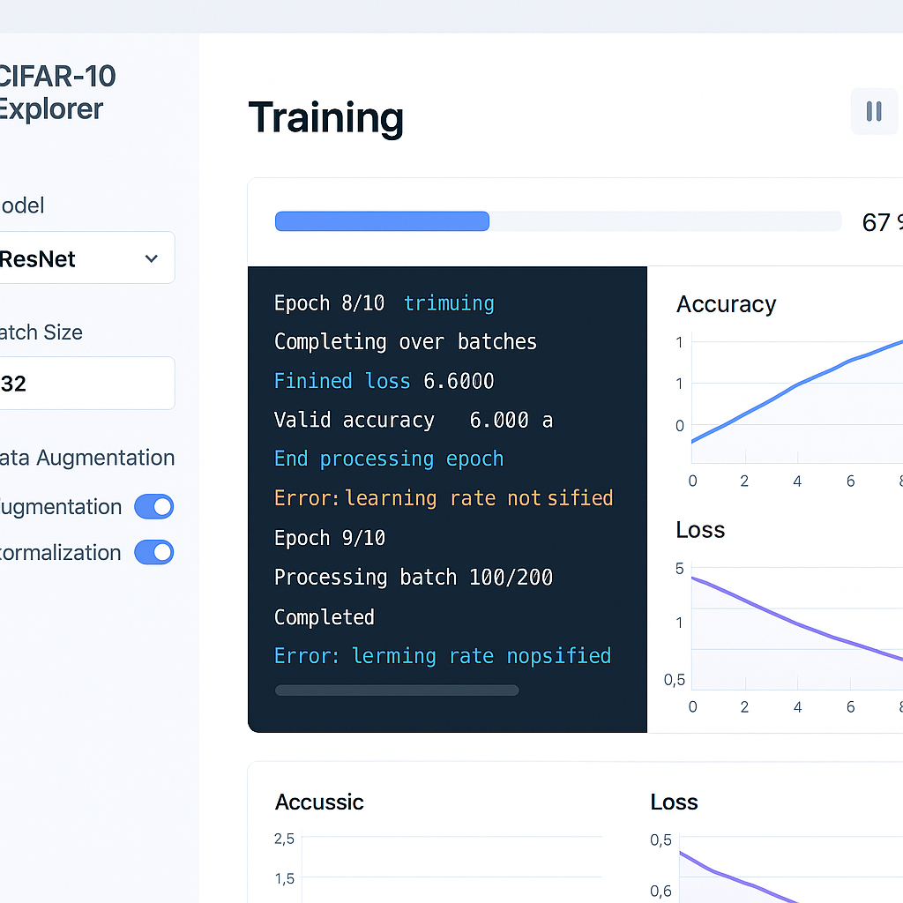

# CIFAR-10 Explorer (v2.0.0)

  


> A professional interface for exploring, visualizing, and training models on the CIFAR-10 dataset - now with an enhanced UI and expanded capabilities.

## What's New in Version 2.0?

Version 2.0 of CIFAR-10 Explorer brings a completely refreshed user interface and several new features:

- **Redesigned UI**: Modern, clean interface with improved usability
- **Enhanced Visualizations**: Better data and training metrics visualization
- **Expanded Model Options**: Additional architectures and configuration options
- **Improved Performance**: Faster data loading and more efficient training simulation
- **Better Mobile Support**: Responsive design works on devices of all sizes

## Key Features

### Streamlined Dataset Explorer
- Interactive category cards with instant preview
- Enhanced image browsing with filtering options
- Detailed dataset statistics and insights
- Seamless switching between training and test sets

### Advanced Training Center
- Configure and train models with a user-friendly interface
- Real-time training progress visualization
- Interactive terminal with detailed logs
- Progress tracking with estimated completion time

### Improved Model Management
- Comprehensive model cards with key metrics
- Performance comparison between models
- One-click model download
- Detailed model architecture information

### Modern User Experience
- Clean, consistent design language
- Smooth animations and transitions
- Improved navigation and information architecture
- Accessibility improvements

## Getting Started

### Prerequisites
- A modern web browser (Chrome, Firefox, Safari, or Edge)
- Basic understanding of machine learning concepts

### Installation

1. Clone the repository:
```bash
git clone https://github.com/yourusername/cifar10-explorer.git
cd cifar10-explorer
```

2. Start a local development server:
```bash
# Using Python
python -m http.server 8000

# Using Node.js
npx serve
```

3. Navigate to http://localhost:8000 in your browser

### Quick Start Guide

1. **Explore the Dataset**: Browse categories and examine sample images
2. **Configure a Model**: Select architecture and training parameters
3. **Start Training**: Watch real-time progress and performance metrics
4. **Evaluate Results**: Examine model performance and save for future use

## Technical Details

### Technology Stack
- HTML5, CSS3, and JavaScript (ES6+)
- Responsive design with CSS Grid and Flexbox
- Dynamic UI updates with vanilla JavaScript
- Local storage for saving preferences and models

### Project Structure

```
cifar10-explorer/
├── index.html           # Main application entry point
├── css/
│   └── styles.css       # Enhanced stylesheet with component designs
├── js/
│   └── scripts.js       # Core application logic
└── datasets/            # Dataset directory (not included)
    └── cifar-10/
        └── images/
            ├── train/   # Training images (50,000)
            └── test/    # Test images (10,000)
```

## Contributing

Contributions are welcome! Here's how you can help:

1. Fork the repository
2. Create your feature branch: `git checkout -b feature/amazing-feature`
3. Commit your changes: `git commit -m 'Add some amazing feature'`
4. Push to the branch: `git push origin feature/amazing-feature`
5. Open a Pull Request

## Upcoming in Future Versions

- Dark mode support
- Advanced analytics dashboard
- Custom architecture builder
- Export to TensorFlow.js and ONNX formats
- Collaborative features for teams

## License

This project is licensed under the MIT License - see the LICENSE file for details.

## Acknowledgments

- CIFAR-10 dataset by Alex Krizhevsky, Vinod Nair, and Geoffrey Hinton
- Feedback from our growing community of users
- Inspired by professional ML tools and platforms
